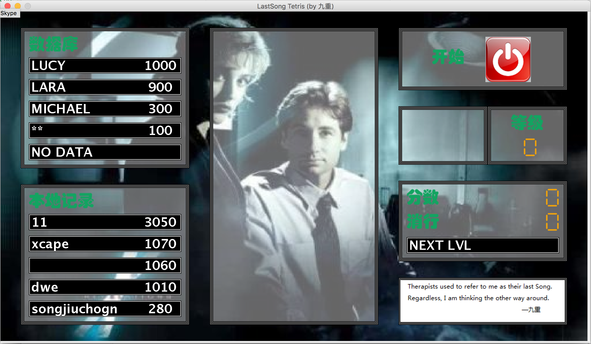
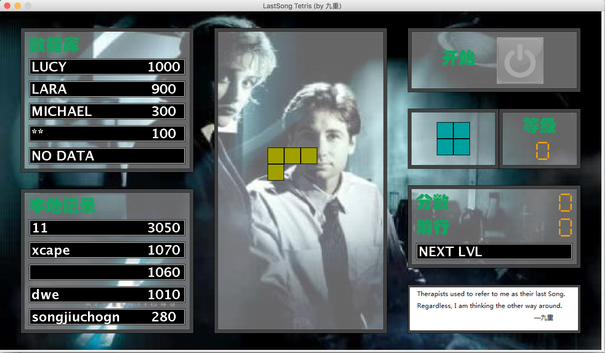
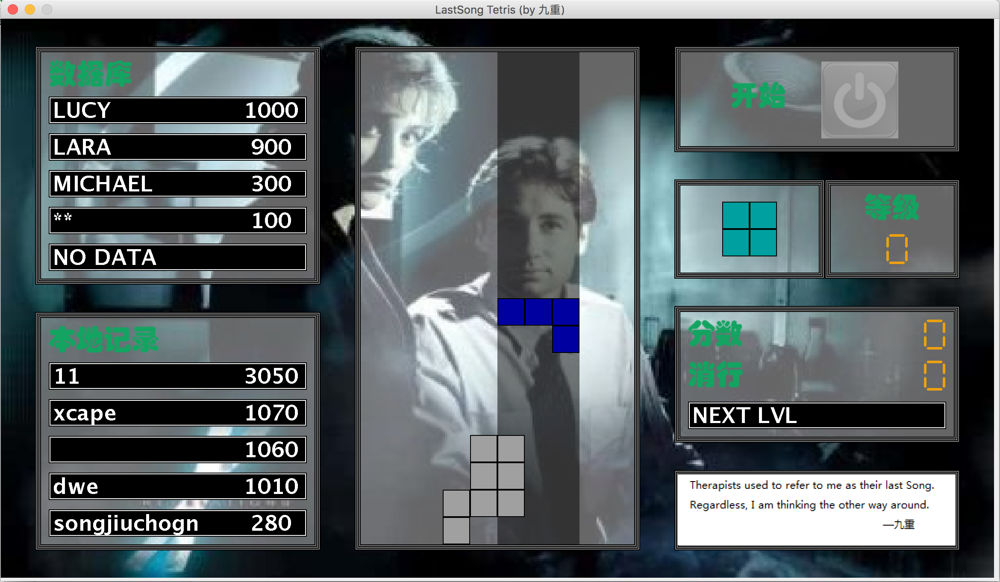
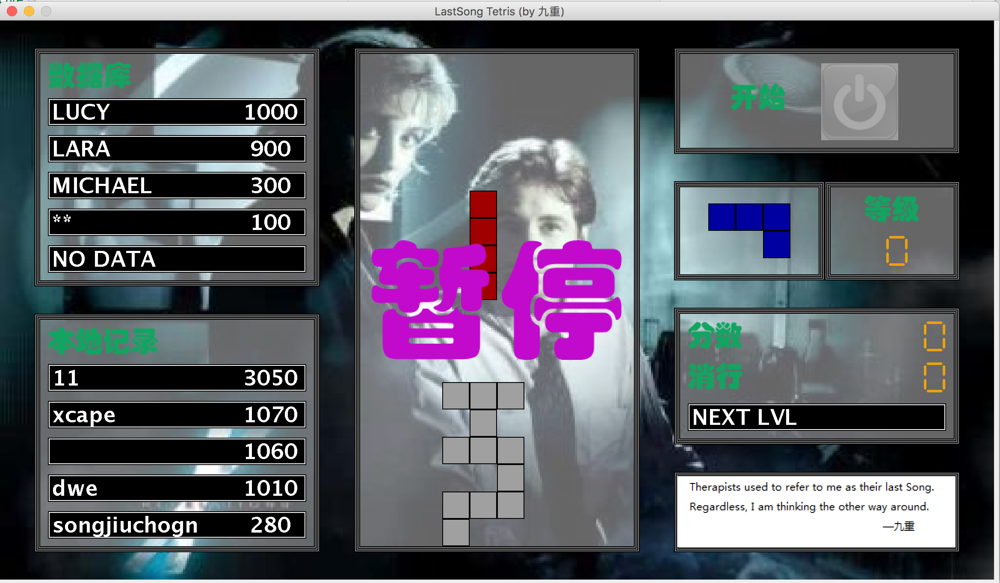
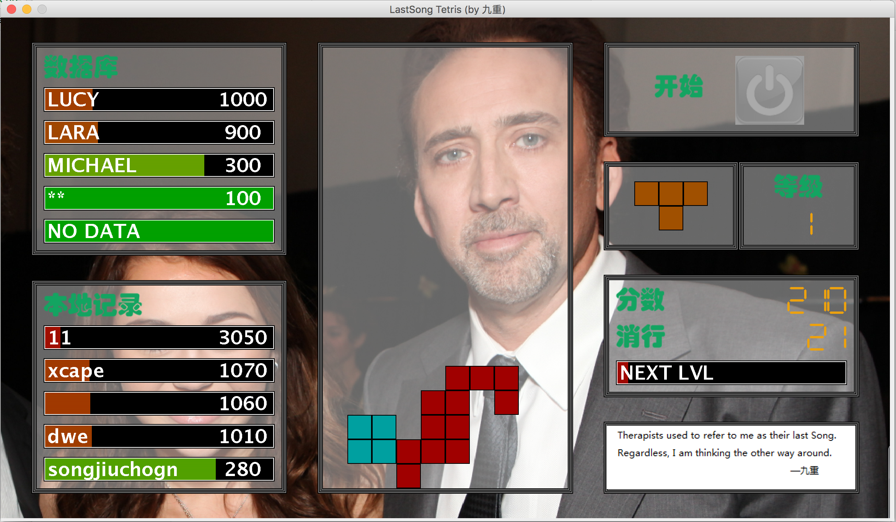
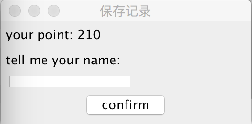

# Lastsong-Tetris
使用JAVA编写的俄罗斯方块程序, 具有非常全面的功能.

 

游戏基本规则:

1.打开游戏窗口后, 点击开始按钮进行游戏;
2.每消一行就会增加10分和1消行数,当分数累计到200(20行)就会来到下一个level(等级从0开始递增),每提升一个等级方块下落速度会略微增加,背景图片会切换,已经下落方块的颜色会改变(正在下落方块的颜色都是随机生成的,与等级无关);
3.游戏结束后会弹出保存记录窗口要求用户输入名称,点击confirm按钮后游戏才可以重新开始;
4.本地记录保存在save文件夹下的record.dat文件中,数据库记录保存在指定的数据库中;
5.MAC操作系统中运行时本地记录保存窗口可能存在无法前置的问题,待修复;

按键提示:

方向键上 ↑/W : 转动方块;
方向键下 ↓/S : 加速方块下落;
方向键左 ←/A : 向左侧移动方块;
方向键右 →/D : 向右侧移动方块;

按键P : 暂停/继续游戏;
按键B : 开启/关闭方块垂直方向的阴影背景效果;
按键空格 SPACE : 使方块瞬间下落到最底端;
按键[ : 测试(作弊)模式, 增加10分数和1消行,同时next level进度条会增长5%,数据库以及本地记录进度条会增长1%;

游戏截图:

疑难解答:

Windows不能用鼠标双击运行jar文件怎么办？

Java应用程序jar文件可以由 JVM（Java虚拟机）直接执行，只要操作系统安装了JVM便可以运行作为Java应用程序的jar文件，其跨平台特性使得很多工具软件都用jar方式来部署分发，比如:用于HP WebOS系列手机常用的工具软件WebOSQuickInstall（简称WQI）就是采用jar方式;

可是，有些时候下载了jar文件以后在Windows中不能用鼠标双击运行（或者双击运行以后使用WinRAR或其他压缩软件打开了），解决方法如下:

工具/原料
Java虚拟机（JVM）
Windows注册表编辑器regedit
Windows管理员权限的用户帐户
Win7下的解决方法
1
下载并安装最新版的Java虚拟机（JVM）;
下载网址：http://www.java.com/zh_CN/
注意：无论是Win7还是WinXP，都需要事先下载并安装Java虚拟机;

2
安装好Java虚拟机后，双击需要运行的jar文件或在jar文件上点击鼠标右键，在弹出的菜单中选择“打开方式”→“选择默认程序”;

3
在“打开方式”设置窗口中点击选中选项“始终使用选择的程序打开这种文件”前的复选框，再点击旁边的“浏览”按钮;

4
选择JAVA虚拟机的安装文件夹，如果安装的是Java 7，安装文件夹一般为“C:\Program Files\Java\jre7\bin”（具体文件夹请自行查找），找到javaw.exe文件，点击“打开”按钮;

5
这时已经设置了使用javaw.exe应用程序来打开jar文件，可是实际上这时双击jar文件还是没有反应，这是因为没有设置打开文件参数导致的;
在Windows开始菜单的搜索框中输入“regedit”，在上方搜索出的文件regedit上点击鼠标右键，在弹出的菜单中选择“以管理员身份运行”;

6
在注册表编辑器中，找到“HKEY_CLASSES_ROOT\Applications\javaw.exe\shell\open\command”，在其中文件打开命令中加入参数“-jar”（无引号），修改后的数值类似：“"C:\Program Files\Java\jre7\bin\javaw.exe" -jar "%1"”（只需要添加-jar参数，无需修改其他信息），保存并退出注册表编辑器;

补充:
WinXP下的解决方法
安装好Java虚拟机后，打开桌面上“我的电脑”，点击菜单“工具”→“文件夹选项”;

在“文件夹选项”设置窗口中切换到“文件类型”标签。找找看其中的文件扩展名有没有.jar，如果有，则选择.jar文件，点击“更改”按钮。如果没有.jar，那么点击“新建”按钮新建一个.jar扩展名;

点击“高级”按钮，在出现“编辑文件类型”窗口中点击“新建”按钮，在弹出的“新操作”设置窗口中，将操作命名为“open”，用于执行操作的应用程序为“C:\Program Files\Java\jre7\bin\javaw.exe" -jar "%1”（请勿填写引号，具体JVM的文件夹路径请根据实际情况填写，一般位于C:\Program Files\Java中）;
设置完成后退出保存退出即可;

END
注意事项
要使jar文件正常运行，其文件名不能为中文或其他特殊字符，如果按照本文操作还是不能运行，请尝试修改文件名为标准的英文文件名;
